# MongoDB Atlas - Onboarding of customers

---
## Setup

**_1. Copy MongoDB Atlas connection string (we will use on step 5)_**

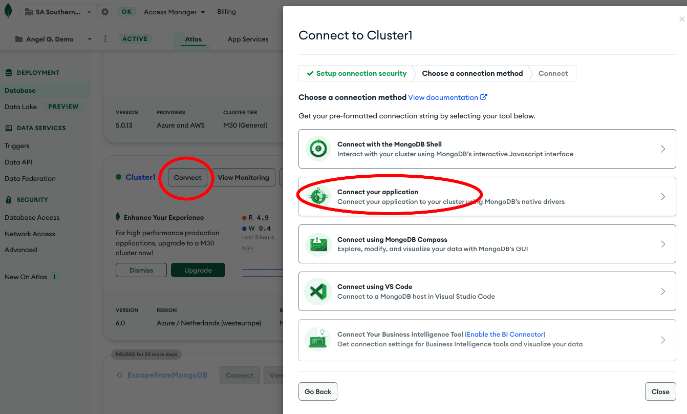


**_2. Configure MongoDB Atlas IP WhiteList to allow all (don't do in Production please !!)_**

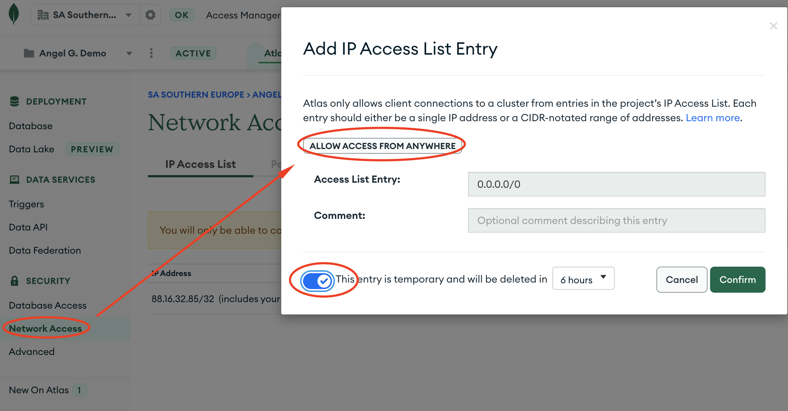


**_3. Start GitHub Codespaces_**

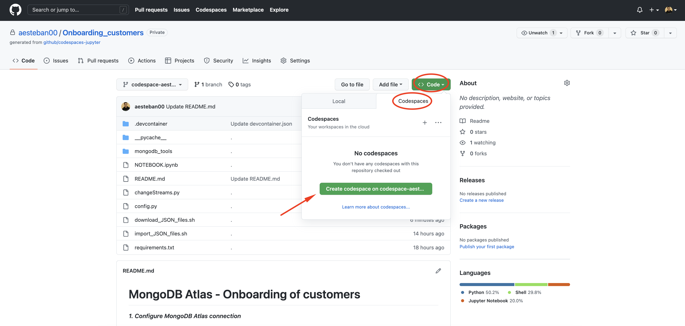


**_4. Change README.md to Preview mode_**

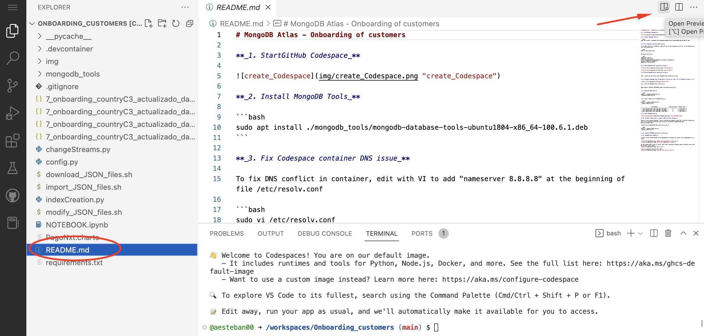


**_5. Paste MongoDB Atlas connection string (obtained on step 1)_**

```
Edit ./config.py and insert your MongoDB Atlas connection string
```

**_6. Execute setup\_1.sh_**

```bash
./scripts/setup_1.sh
```

**_7. Import JSON files to MongoDB Atlas (it should take 3 min for 500.000 docs using small Lab cluster)_**

```bash
./scripts/import_JSON_files.sh
```

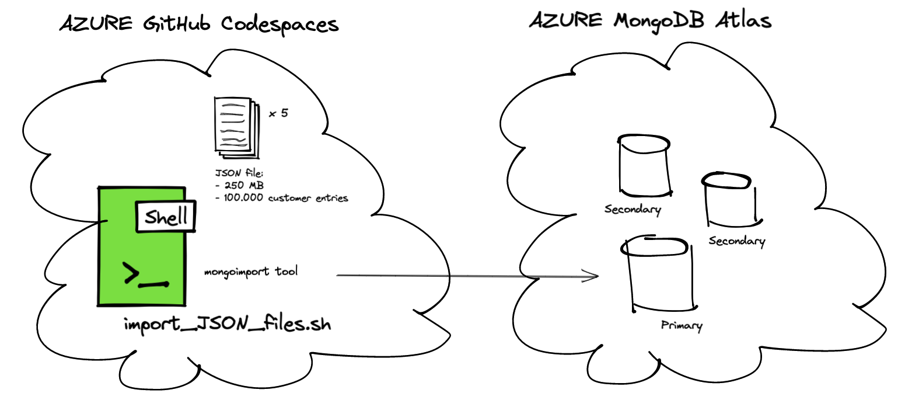

---
## Execution Lab 1 and 2 on Jupyter NOTEBOOK

**_Jump to Jupyter NOTEBOOK to practice with MongoDB Python_**

```
Open ./NOTEBOOK.ipynb and execute the exercises
```

---
## Execution Lab 3 with ChangeStreams Python script

**_Lab 3 - Exercise 1 - Start ChangeStreams_**

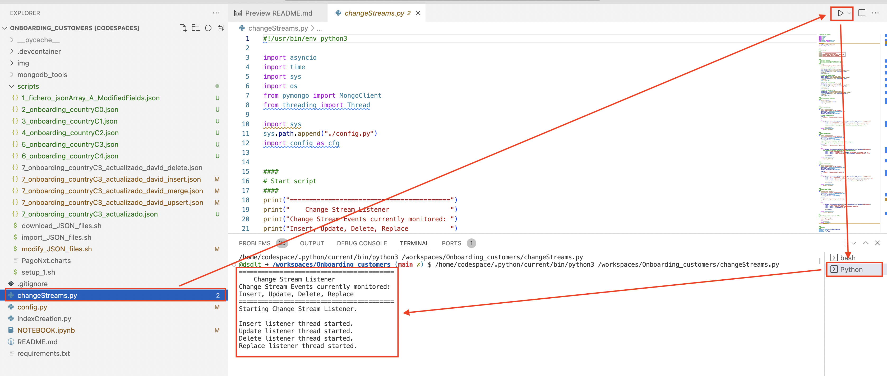

**_Lab 3 - Exercise 2 - Import JSON files with changes (from Bash shell, not ChangeStreams shell from step before)_**

These 4 files contains updates, inserts, deletes and upserts. With this script all operations will run in parallel and events can be seen in the Python ChangeStream app.
Execute on bash shell:

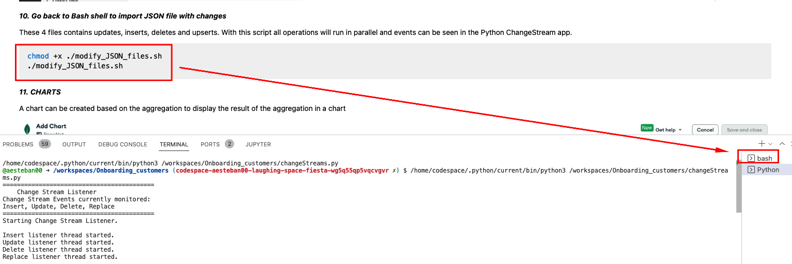

```bash
./changestreams_modify_JSON_files.sh
```

**_Lab 3 - Challenge time!_**

Edit the Python script ./changeStreams.py to do the following:
- Filter updates and print in the console only the updates performed on customers where document type is a passport.


---
## MongoDB Atlas Charts

**_A chart can be created based on the aggregation to display the result of the aggregation in a chart_**

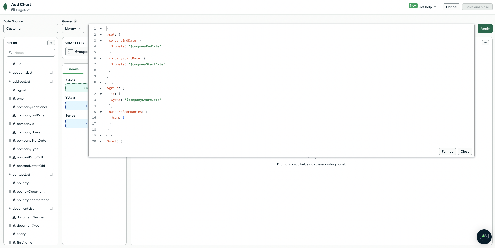
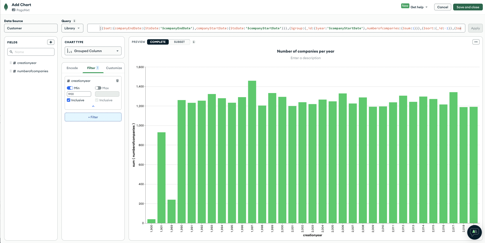

This is the aggregation pipeline you can use:

```yaml
[{$set:{
	companyEndDate:{
		$toDate:'$companyEndDate'
	}
	,companyStartDate:{
		$toDate:'$companyStartDate'
	}
}
}
,{
$group:{
	_id:{
		$year:'$companyStartDate'
	}
	,numberofcompanies:{
		$sum:1
	}
}
}
,{
$sort:{
	_id:-1
}
}
,{
$set:{
	creationyear:'$_id'
}
}
,{
$project:{
	creationyear:1,numberofcompanies:1,_id:0
}
}]
```


**_We can create other types of charts. Next chart represents company names by number (word size) and country (word colour)_**

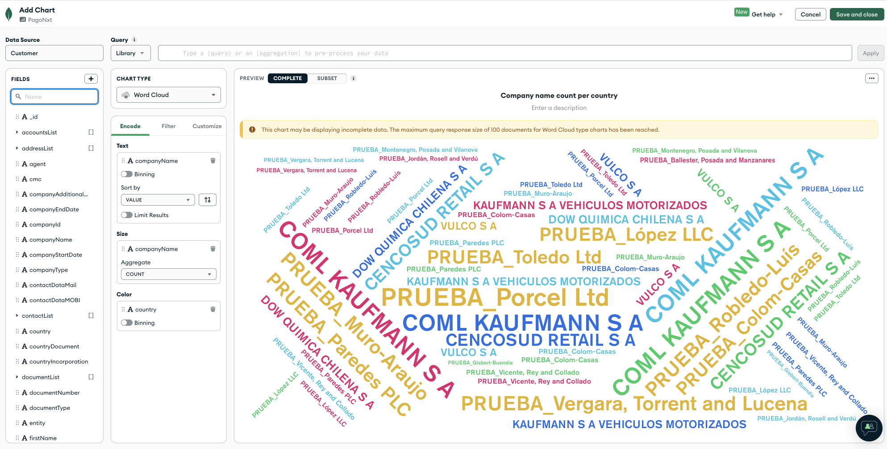

**_This is a general view with all charts_**
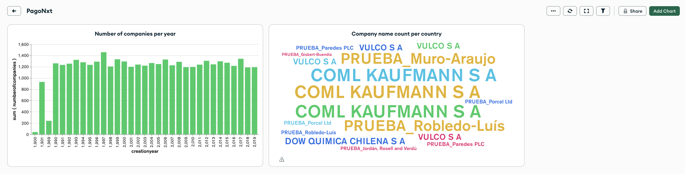