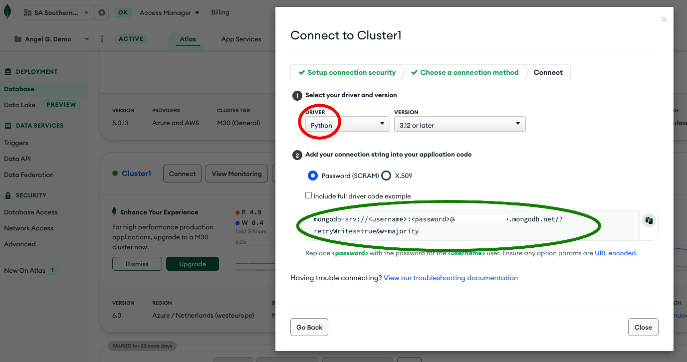

# MongoDB Atlas - Onboarding of customers

---
## Setup

**_1. Copy MongoDB Atlas connection string (we will use on step 5)_**





**_2. Configure MongoDB Atlas IP WhiteList to allow all (don't do in Production please !!)_**


**_3. Start GitHub Codespaces_**


**_4. Change README.md to Preview mode_**


**_5. Paste MongoDB Atlas connection string (obtained on step 1)_**

```
Edit ./config.py and insert your MongoDB Atlas connection string
```

**_6. Execute setup\_1.sh_**

```bash
./scripts/setup_1.sh
```

**_7. Import JSON files to MongoDB Atlas (it should take 3 min for 500.000 docs using small Lab cluster)_**

```bash
./scripts/import_JSON_files.sh
```


---
## Execution Lab 1 and 2 on Jupyter NOTEBOOK

**_Jump to Jupyter NOTEBOOK to practice with MongoDB Python_**

```
Open ./NOTEBOOK.ipynb and execute the exercises
```

---
## Execution Lab 3 with ChangeStreams Python script

**_Lab 3 - Exercise 1 - Start ChangeStreams_**


**_Lab 3 - Exercise 2 - Import JSON files with changes (from Bash shell, not ChangeStreams shell from step before)_**

These 4 files contains updates, inserts, deletes and upserts. With this script all operations will run in parallel and events can be seen in the Python ChangeStream app.
Execute on bash shell:


```bash
./changestreams_modify_JSON_files.sh
```

**_Lab 3 - Challenge time!_**

Edit the Python script ./changeStreams.py to do the following:
- Filter updates and print in the console only the updates performed on customers where document type is a passport and company name is 'VULCO S A'


---
## MongoDB Atlas Charts

**_A chart can be created based on the aggregation to display the result of the aggregation in a chart_**


This is the aggregation pipeline (yaml file) you can use:

```
[{$set:{
	companyEndDate:{
		$toDate:'$companyEndDate'
	}
	,companyStartDate:{
		$toDate:'$companyStartDate'
	}
}
}
,{
$group:{
	_id:{
		$year:'$companyStartDate'
	}
	,numberofcompanies:{
		$sum:1
	}
}
}
,{
$sort:{
	_id:-1
}
}
,{
$set:{
	creationyear:'$_id'
}
}
,{
$project:{
	creationyear:1,numberofcompanies:1,_id:0
}
}]
```


**_We can create other types of charts. Next chart represents company names by number (word size) and country (word colour)_**


**_This is a general view with all charts_**


---
## MongoDB Atlas Realm Sync

**_App Services and Sync_**

You can also use App Services to synchronize bidirectionally a subset of your data with MongDB from your native mobile application.

Once you open the Android project in Android Studio, you will find the classes containing the data model that have to match the schema generated in the App Services App.


In this screen you have the main parts of code you need to login and create the query that defines the subset of data that will be synchronized in MongoDB.
- The first part is the Authorization (methods related with the App class) to login.
- The second part you need is to define the set of classes that are part of the schema in the App in App Services
- Then, define the query to create the subset. These queries can only use queryable fields (i.e.: fields you have defined in the App in App Services in the Sync section).


This screen shows the piece of code that you need to query the data locally (that will be synchronized in real time in a background thread for you).

To create the query you use realm.query and the query you want to perform. This will create a pointer to your data but the query won't be executed until you start fetching data, and only the fields you use are the fields that will be loaded into memory.

The collect method  is used to subscribe to changes in the data. For every change in your data, depending on the type of change, a piece of code can be executed to refresh your list. Doing this, you can only refresh the UI when a change has been detected.


Once you create the app in App Services, you can generate a schema out of your data.


Below is the schema you can use that matches the data layer in the Android app:

```
{
  "properties": {
    "_id": {
      "bsonType": "objectId"
    },
    "accountsList": {
      "bsonType": "array",
      "items": {
        "bsonType": "object",
        "properties": {
          "accountIdBba": {
            "bsonType": "string"
          },
          "accountTypeBba": {
            "bsonType": "string"
          },
          "agentAccount": {
            "bsonType": "string"
          },
          "balanceAllowed": {
            "bsonType": "bool"
          },
          "currencyCode": {
            "bsonType": "string"
          },
          "internationalPaymentsAllowed": {
            "bsonType": "bool"
          },
          "status": {
            "bsonType": "string"
          },
          "transactionsAllowed": {
            "bsonType": "bool"
          }
        },
        "title": "Accounts"
      }
    },
    "addressList": {
      "bsonType": "array",
      "items": {
        "bsonType": "object",
        "properties": {
          "addressType": {
            "bsonType": "string"
          },
          "country": {
            "bsonType": "string"
          },
          "postCodeId": {
            "bsonType": "string"
          },
          "province": {
            "bsonType": "string"
          },
          "regionId": {
            "bsonType": "string"
          },
          "state": {
            "bsonType": "string"
          },
          "streetBuildingId": {
            "bsonType": "string"
          },
          "streetName": {
            "bsonType": "string"
          },
          "townName": {
            "bsonType": "string"
          }
        },
        "title": "Addresses"
      }
    },
    "agent": {
      "bsonType": "string"
    },
    "cmc": {
      "bsonType": "string"
    },
    "companyAdditionalDetail": {
      "bsonType": "double"
    },
    "companyEndDate": {
      "bsonType": "date"
    },
    "companyId": {
      "bsonType": "string"
    },
    "companyName": {
      "bsonType": "string"
    },
    "companyStartDate": {
      "bsonType": "date"
    },
    "contactDataMOBI": {
      "bsonType": "string"
    },
    "contactDataMail": {
      "bsonType": "string"
    },
    "contactList": {
      "bsonType": "array",
      "items": {
        "bsonType": "object",
        "properties": {
          "contactData": {
            "bsonType": "string"
          },
          "contactType": {
            "bsonType": "string"
          }
        },
        "title": "Contacts"
      }
    },
    "country": {
      "bsonType": "string"
    },
    "countryDocument": {
      "bsonType": "string"
    },
    "countryIncorporation": {
      "bsonType": "string"
    },
    "documentList": {
      "bsonType": "array",
      "items": {
        "bsonType": "object",
        "properties": {
          "documentNumber": {
            "bsonType": "string"
          },
          "documentType": {
            "bsonType": "string"
          }
        },
        "title": "Documents"
      }
    },
    "documentNumber": {
      "bsonType": "string"
    },
    "documentType": {
      "bsonType": "string"
    },
    "duration_days": {
      "bsonType": "long"
    },
    "entity": {
      "bsonType": "string"
    },
    "firstName": {
      "bsonType": "string"
    },
    "internalRepresentUser": {
      "bsonType": "string"
    },
    "lastName": {
      "bsonType": "string"
    },
    "relationshipType": {
      "bsonType": "string"
    },
    "segmentLocal": {
      "bsonType": "string"
    },
    "segmentTypeGlobal": {
      "bsonType": "string"
    },
    "segmentTypeLocal": {
      "bsonType": "string"
    },
    "tradeName": {
      "bsonType": "string"
    },
    "typeDisposition": {
      "bsonType": "string"
    }
  },
  "title": "Customer"
}
```

Remember to enable the Email / Password authentication and create a user.


Last step is to enable Sync. Here you have the configuration to use. You can see there the queryable fields that we are using in the Android app and the permissions we are defining on the data to secure it.
 
